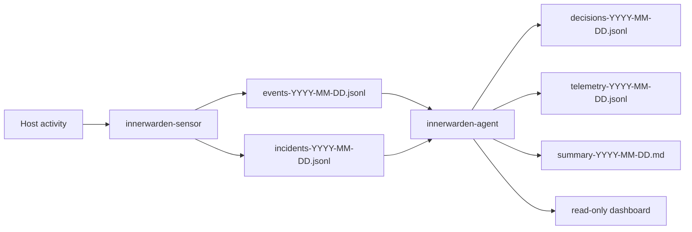

# InnerWarden

InnerWarden is a host-security observability and response system built around two Rust components:

- `innerwarden-sensor`: deterministic host telemetry collection and incident detection
- `innerwarden-agent`: incremental analysis, AI-assisted triage, dashboarding, and optional response skills

The project is designed to stay useful in safe, low-automation deployments first. The default posture is conservative:

- data collection is append-only JSONL
- responders can be disabled
- `dry_run = true` is the recommended starting point
- privacy-sensitive collectors are explicit opt-ins

## Status

InnerWarden is an actively developed `0.x` project.

Current state:

- production-trial oriented, not yet audited
- single-host focus
- dashboard available for read-only local/remote investigation
- host response actions gated by config and confidence thresholds

This is not a full EDR platform, not a SIEM, and not a promise of autonomous remediation safety in every environment.

## What It Does

### Sensor

- tails `/var/log/auth.log` and parses SSH auth activity
- reads `journald` for `sshd`, `sudo`, `kernel`, or any configured unit
- optionally ingests `auditd` command execution and TTY records
- watches Docker events
- polls file integrity with SHA-256
- emits normalized `events-YYYY-MM-DD.jsonl`
- emits detector-driven `incidents-YYYY-MM-DD.jsonl`

### Agent

- reads JSONL incrementally via byte offsets
- applies a cheap algorithmic gate before any AI call
- correlates incidents in a short time window
- writes append-only `decisions-YYYY-MM-DD.jsonl`
- writes operational `telemetry-YYYY-MM-DD.jsonl`
- serves a read-only dashboard with attacker journey investigation
- can execute bounded response skills when explicitly enabled

## Architecture

```text
Host Activity
  -> innerwarden-sensor
     -> events-YYYY-MM-DD.jsonl
     -> incidents-YYYY-MM-DD.jsonl
  -> innerwarden-agent
     -> decisions-YYYY-MM-DD.jsonl
     -> telemetry-YYYY-MM-DD.jsonl
     -> summary-YYYY-MM-DD.md
     -> local dashboard / report output
```



## Supported Environments

Current support target:

- Linux hosts with `systemd`
- Ubuntu 22.04 is the primary production-trial reference environment

Local development works well anywhere Rust and the required tooling are available, but the install, service, and privileged response flows are Linux-first.

## Project Maturity

Treat the project as:

- `0.x` and still evolving
- trial-ready for careful operators
- not externally audited
- optimized for single-host deployments first
- conservative by default, especially around automated response

## Safety Model

Before using this outside local testing, read these guardrails carefully:

- response skills are optional and config-gated
- `dry_run = true` should be your default during rollout
- shell trail via `auditd` is privacy-sensitive and should only be enabled with explicit authorization
- honeypot features are bounded and opt-in, but still require operational judgment
- AI is advisory unless you explicitly allow auto-execution and accept the configured confidence threshold

## Quickstart

### 1. Build and test

```bash
make test
make build
```

### 2. Run locally with fixture config

```bash
make run-sensor
make run-agent
```

The sensor writes to `./data/` and the agent reads from the same directory.

### 3. Start the dashboard

```bash
innerwarden-agent --dashboard-generate-password-hash
export INNERWARDEN_DASHBOARD_USER=admin
export INNERWARDEN_DASHBOARD_PASSWORD_HASH='$argon2id$...'
make run-dashboard
```

Default dashboard address:

- `http://127.0.0.1:8787`

The dashboard is read-only, but authentication is mandatory.

## Trial Install on Linux

A guided installer is available for systemd-based Linux hosts:

```bash
./install.sh
```

What it does:

- builds release binaries
- installs `innerwarden-sensor` and `innerwarden-agent`
- creates `/etc/innerwarden/{config.toml,agent.toml,agent.env}`
- creates systemd units
- starts in a conservative trial profile

Recommended first rollout posture:

- `responder.enabled = false`
- `dry_run = true`
- dashboard auth configured before exposing the service remotely

## Safe Update Path

To update an existing server deployment without reinstalling everything:

```bash
make deploy HOST=user@server
ssh user@server "sudo systemctl restart innerwarden-agent innerwarden-sensor"
make rollout-postcheck HOST=user@server
```

Recommended rollout sequence:

```bash
make rollout-precheck HOST=user@server
make deploy HOST=user@server
ssh user@server "sudo systemctl restart innerwarden-agent innerwarden-sensor"
make rollout-postcheck HOST=user@server
```

Fast rollback path:

```bash
make rollout-rollback HOST=user@server
make rollout-stop-agent HOST=user@server
```

## Distribution Model

Current public distribution is source-first:

- build from source with Cargo
- install to a Linux host with `./install.sh`
- update with `make deploy` plus service restart

Publishing crates or packaged binaries is not part of the initial public launch plan.

## Versioning Policy

InnerWarden is currently versioned as `0.x`.

Implications:

- expect change while the product and operational model are still settling
- prefer pinning a commit or release tag for repeatable deployments
- read changelog entries and rollout notes before upgrading production-trial hosts

## FAQ

### Is this an EDR?

No. It is a focused host-security observability and response project with append-only artifacts, bounded investigation features, and optional response skills.

### Does it block by default?

No. The safe starting posture is responder disabled and `dry_run = true`.

### Do I need OpenAI to use it?

No for collection, detection, JSONL artifacts, reports, and dashboarding. AI is only needed for the AI-assisted decision layer.

### Can I use it without honeypot features?

Yes. Honeypot behavior is optional and config-gated.

## Repository Guide

- [docs/index.md](docs/index.md) — documentation map
- [CHANGELOG.md](CHANGELOG.md) — release notes and notable changes
- [CONTRIBUTING.md](CONTRIBUTING.md) — contributor workflow
- [SECURITY.md](SECURITY.md) — vulnerability reporting guidance
- [docs/format.md](docs/format.md) — JSONL schemas
- [docs/development-plan.md](docs/development-plan.md) — roadmap and phase history
- [CLAUDE.md](CLAUDE.md) — maintainer-oriented operating document kept in-repo for now

## Public Launch Notes

This repository is being prepared for public release, but some maintainer-oriented material is intentionally still present because it remains useful during active development.

Before the repo becomes public, review:

- maintainer/internal process wording in `CLAUDE.md`
- any local assistant/editor files that should stay ignored
- screenshots and release notes for the first public-facing release

## License

MIT. See [LICENSE](LICENSE).
